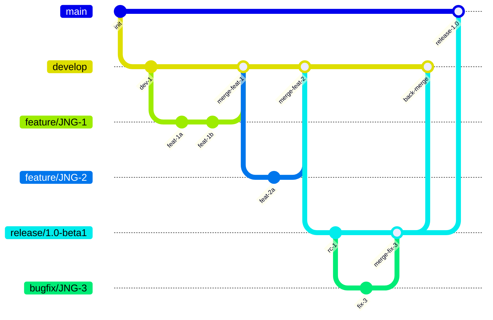
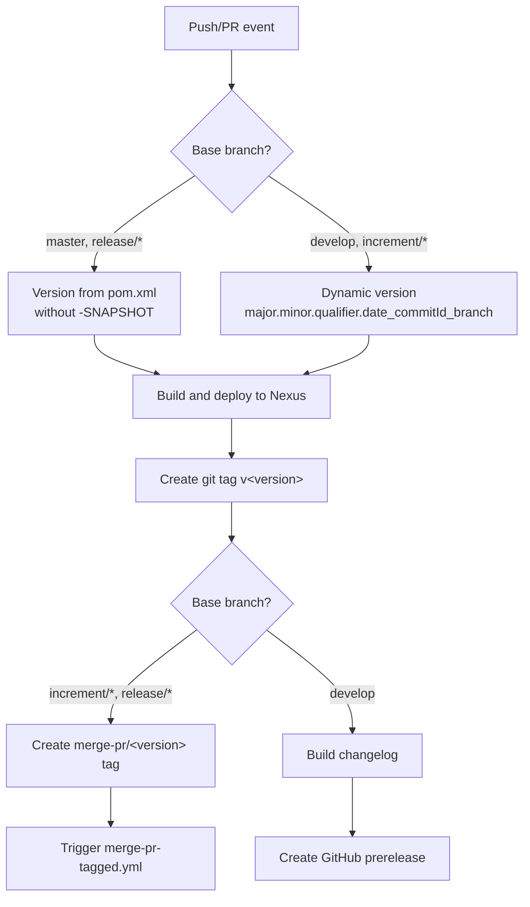
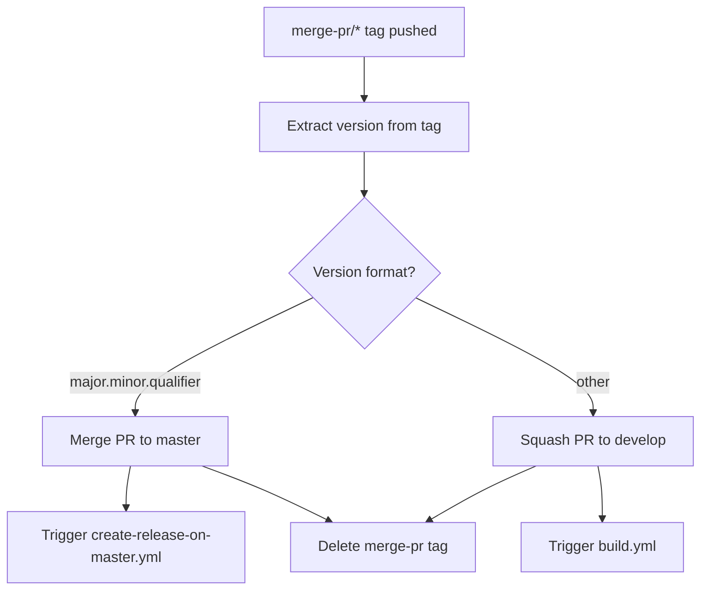
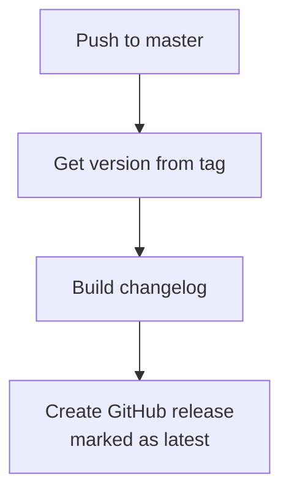
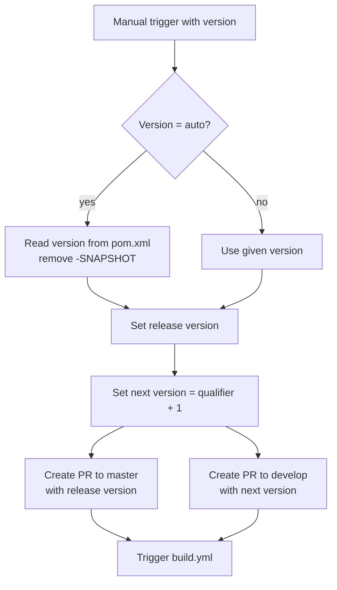

# CI/CD Flow: Development Versions and Branch Handling

This document describes the branching strategy, versioning policy, and GitHub Actions CI/CD pipelines used by this project.

## Branching Strategy

The project follows a [GitFlow](https://www.atlassian.com/git/tutorials/comparing-workflows/gitflow-workflow) branching model.



### Branch Types

| Branch | Base | Purpose |
|--------|------|---------|
| `develop` | — | Main development branch; contains latest development sources |
| `feature/JNG-xxx_summary` | `develop` | New features for the next release |
| `release/x.y-qualifier` | `develop` | Release stabilization and testing |
| `bugfix/JNG-xxx_summary` | `release/*` | Bug fixes during release testing (applied to release and newer develop) |
| `support/JNG-xxx_summary` | `release/*` | Minor changes for a previous release; merged back to release branch |
| `hotfix/JNG-xxx_summary` | `master` | Critical fixes applied to both release and master |
| `master` | — | Latest released sources |

## Version Numbers

Versioning follows semantic versioning with these rules:

| Event | Version change |
|-------|---------------|
| Start a `feature/` branch | No change |
| Start a `release/` branch | 2nd number on `develop` is incremented |
| Start a `bugfix/` branch | No change (applied to release branch) |
| Start a `support/` branch | 3rd number is incremented |
| Start a `hotfix/` branch | 4th number is incremented |

### Dynamic Version Format

On `develop` and `increment/*` branches, versions are computed dynamically:

```
major.minor.qualifier.YYYYMMDD_HHmmss_commitId_branchName
```

On `master` and `release/*` branches, the version comes directly from `pom.xml` (without `-SNAPSHOT`).

## GitHub Actions Workflows

### build.yml — Main Build Pipeline

Triggered on pushes to `develop` and pull requests targeting `develop`, `master`, `increment/*`, or `release/*`.



### merge-pr-tagged.yml — PR Merge Automation

Triggered when a `merge-pr/*` tag is pushed.



### create-release-on-master.yml — Release Creation

Triggered on pushes to `master`.



### release.yml — Release Orchestration

Manually triggered with a version parameter (`auto` or `major.minor.qualifier`).



### Other Workflows

| Workflow | Purpose |
|----------|---------|
| `bump-version.yml` | Automated version management |
| `build-dependabot.yml` | Dependabot PR integration |
| `delete-old-draft-releases.yml` | Cleanup of stale draft releases |
| `jira-description-to-pr.yml` | Syncs JIRA issue descriptions to PR bodies |
| `sync-labels.yml` | Synchronizes repository labels |

## Development Rules

> **Important:** There is no commit without a ticket number. Every pull request and commit must reference a JIRA ticket (e.g., `JNG-xxx`).

Issue tracking is done via [JIRA](https://blackbelt.atlassian.net/jira/dashboards).
