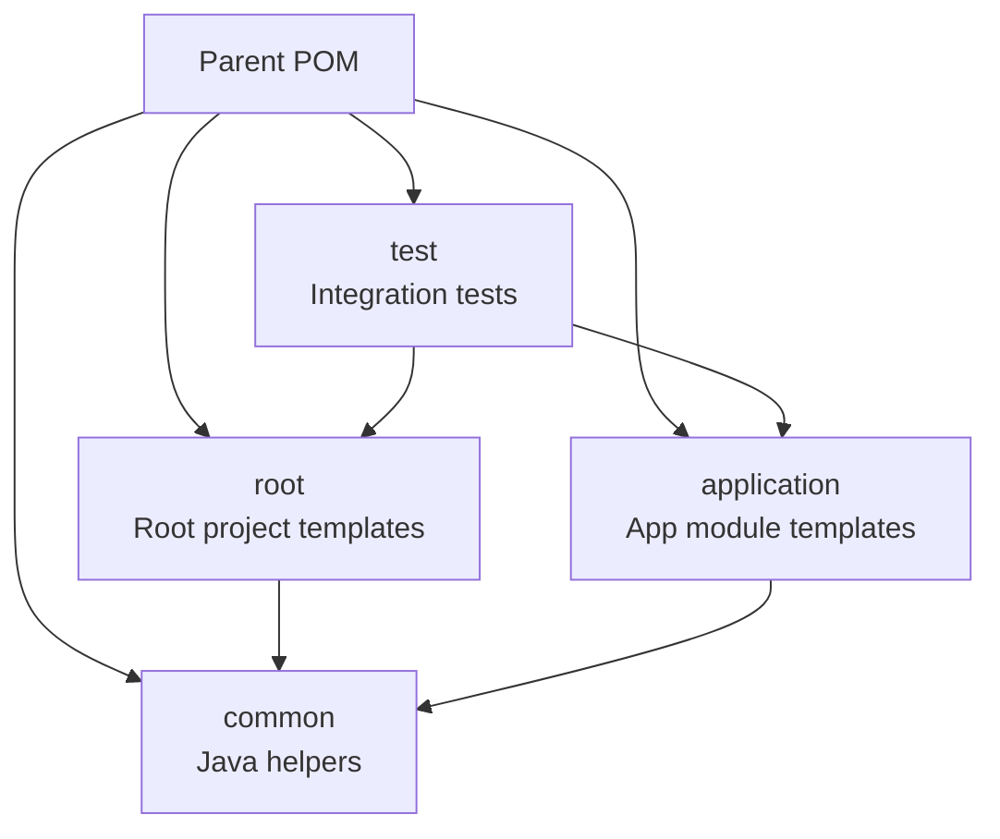

# Contributing to JUDO JSL Fullstack Karaf Project Template

## Development Prerequisites

Your development environment must comply with the requirements in the parent project's [CONTRIBUTING guide](https://github.com/BlackBeltTechnology/judo-community/blob/develop/CONTRIBUTING.adoc). Key requirements:

- **Java 21** JDK
- **Maven 3.9.4+** (or use the included Maven wrapper: `./mvnw`)
- **Docker** (for generated project development features)

## Project Structure

This project is a **template generator** — it is not a runnable application itself. It produces complete Maven project structures when consumed by the `judo-jsl-generator-maven-plugin`. See the [README](README.md) for architecture details.



## Build Commands

```sh
# Run tests only
mvn clean test

# Full build and install to local repository
mvn clean install

# Run a single test class
mvn clean test -pl judo-jsl-fullstack-karaf-project-template-test -Dtest=ClassName

# Skip modules (build parent only)
mvn clean install -DskipModules=true
```

## Maven Profiles

| Profile | Purpose |
|---------|---------|
| `modules` | Active by default — includes all 4 sub-modules. Disable with `-DskipModules=true` |
| `sign-artifacts` | GPG-signs built artifacts for release |
| `release-dummy` | Deploys to a local `/tmp/` directory for testing |
| `release-judong` | Deploys to the JUDO Nexus repository |
| `release-central` | Deploys to Maven Central via Sonatype OSSRH |
| `generate-github-asciidoc-diagrams` | Renders AsciiDoc diagrams to PNG for GitHub display |
| `update-source-code-license` | Updates EPL-2.0 license headers in source files |

## Submitting Issues

Before submitting, search the [issue tracker](https://github.com/BlackBeltTechnology/judo-jsl-fullstack-karaf-project-template/issues) — your problem may already be reported.

When filing a bug, include:

- Output of `java -version` and `mvn -version`
- Your `pom.xml` or `.flattened-pom.xml` (when applicable)
- A minimal reproduction case that demonstrates the failure

A minimal reproduction allows maintainers to confirm the bug quickly and fix the right problem.

File new issues using the [issue form](https://github.com/BlackBeltTechnology/judo-jsl-fullstack-karaf-project-template/issues/new/choose).

## Submitting Pull Requests

This project follows [GitHub's standard forking model](https://guides.github.com/activities/forking/). Fork the project and submit pull requests from your fork.

See the [CI/CD Flow documentation](.github/CIFLOW.md) for details on how branches, versions, and releases are managed.
