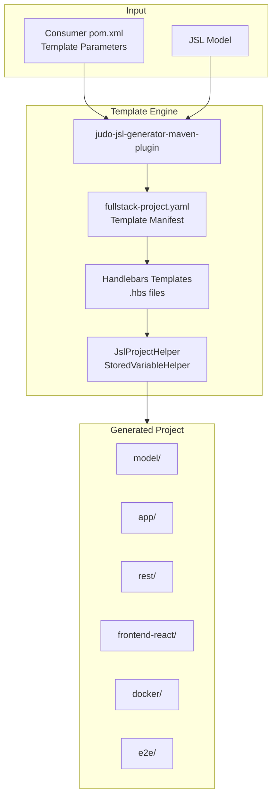

# JUDO JSL Fullstack Karaf Project Template

A Maven-based project template generator that produces complete fullstack applications for the JUDO platform. It uses Handlebars templates and the JSL (JUDO Specification Language) code generator to create ready-to-build project skeletons with backend services, React frontend, Docker configurations, and end-to-end tests — all targeting Apache Karaf as the OSGi runtime.

## How It Works

This project is consumed as a Maven dependency by the `judo-jsl-generator-maven-plugin`. When the plugin runs during `generate-sources`, it reads the template manifests, applies Handlebars templates with your configuration parameters, and writes a complete Maven project structure to the output directory.

The generated project includes conditional modules: you control which parts are generated (model, SDK, REST API, frontend, Docker, E2E tests, Karaf features, etc.) through template parameters in the consuming project's POM.

## Architecture



## Module Overview

| Module | Purpose |
|--------|---------|
| `judo-jsl-fullstack-karaf-project-template-common` | Java helper classes used during template rendering (`JslProjectHelper`, `StoredVariableHelper`) |
| `judo-jsl-fullstack-karaf-project-template-root` | Handlebars templates for the root-level generated project (parent POM, scripts, configs) |
| `judo-jsl-fullstack-karaf-project-template-application` | Templates for application sub-modules: app, docker, e2e, frontend-react, model, rest |
| `judo-jsl-fullstack-karaf-project-template-test` | Integration tests that exercise the template generator end-to-end |

## Template Helpers

Two Java classes assist Handlebars rendering:

### JslProjectHelper

Provides static string transformation methods registered as Handlebars helpers:

| Helper | Description |
|--------|-------------|
| `plainName(fqName)` | Safe naming — lowercase alphanumeric + underscore |
| `pathName(fqName)` | Converts fully qualified names to path format with `__` separators |
| `filePathName(fqName)` | Converts to filesystem path (`/`-separated) |
| `fqClass(fqName)` | Fully qualified Java class name from FQ model name |
| `packageName(fqName)` | Extracts Java package from fully qualified name |
| `capitalizeEL(text)` | Capitalizes first letter using Spring Expression Language |
| `resolveFrontendType(type)` | Resolves frontend framework type (defaults to `react`) |
| `isReact(type)` | Checks if frontend type is React |
| `isMultipleFrontend(type)` | Checks if multiple frontend configurations are specified |

### StoredVariableHelper

A ThreadLocal-based context manager that stores and retrieves template generation flags and configuration values. Key flags control conditional module generation:

- `shouldGenerateModelModule()`, `shouldGenerateSdkModule()`, `shouldGenerateApplicationModule()`
- `shouldGenerateRestModule()`, `shouldGenerateFrontendModule()`, `shouldGenerateE2eModule()`
- `shouldGenerateDockerModule()`, `shouldGenerateKarafModule()`, `shouldGenerateLauncherModule()`
- `shouldGenerateInterceptorModule()`, `shouldGenerateSchemaModule()`, `shouldGenerateKeycloakTheme()`

## Usage Example

Add this to your project's `pom.xml` to generate a complete project skeleton:

```xml
<plugin>
    <groupId>hu.blackbelt.judo.meta</groupId>
    <artifactId>judo-jsl-generator-maven-plugin</artifactId>
    <version>${judo-meta-jsl-version}</version>
    <executions>
        <execution>
            <id>execute-jsl-test-model-from-artifact</id>
            <phase>generate-sources</phase>
            <goals>
                <goal>generate</goal>
            </goals>
            <configuration>
                <uris>
                    <uri>mvn:hu.blackbelt.judo.template:judo-jsl-fullstack-karaf-project-template:${template-version}</uri>
                </uris>
                <helpers>
                    <helper>hu.blackbelt.judo.jsl.fullstack.project.archetype.JslDslProjectHelper</helper>
                </helpers>
                <type>fullstack-project</type>
                <destination>${basedir}/target/classes</destination>
                <templateParameters>
                    <groupId>${project.groupId}</groupId>
                    <artifactId>${project.artifactId}</artifactId>
                    <version>${project.version}</version>
                    <modelGroupId>${project.groupId}</modelGroupId>
                    <modelArtifactId>${project.artifactId}-test-model</modelArtifactId>
                    <modelVersion>${project.version}</modelVersion>
                    <sqlDialects>hsqldb</sqlDialects>
                    <frontendType>react</frontendType>
                    <nodeVersion>18.16.0</nodeVersion>
                    <pnpmVersion>8.6.1</pnpmVersion>
                    <!-- ... additional parameters ... -->
                </templateParameters>
            </configuration>
        </execution>
    </executions>
    <dependencies>
        <dependency>
            <groupId>hu.blackbelt.judo.template</groupId>
            <artifactId>judo-jsl-fullstack-karaf-project-template</artifactId>
            <version>${template-version}</version>
        </dependency>
    </dependencies>
</plugin>
```

> **Note:** All template parameters are mandatory (except where noted as optional) because they are used for the generated project's version definitions. See the full parameter list in the [plugin documentation](https://github.com/BlackBeltTechnology/judo-meta-jsl).

## Build Commands

```sh
# Run tests
mvn clean test

# Full build and install
mvn clean install
```

## Related Documentation

- [Contributing Guide](CONTRIBUTING.md)
- [CI/CD Flow](.github/CIFLOW.md)
- [judo-jsl-generator-maven-plugin docs](https://github.com/BlackBeltTechnology/judo-meta-jsl)
